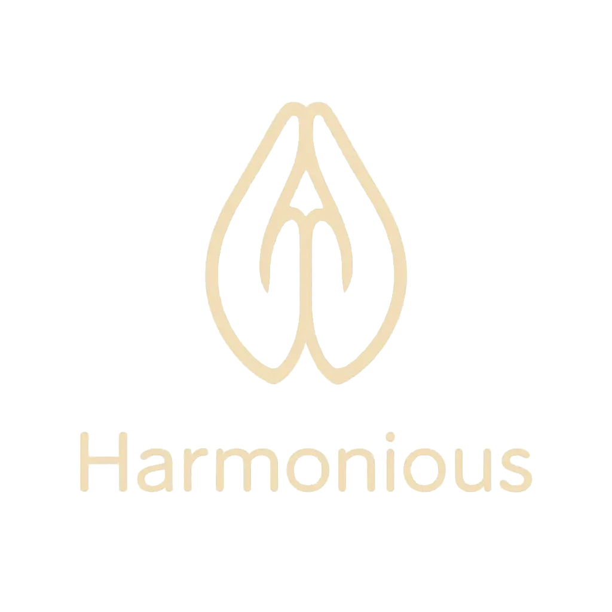

<div align="center">
    <h1>Harmonious</h1>
    
    <p>
    <div>2025年度の Nuxt x Typescript SPAベース</div>
    </p>
    
</div>

## URL

https://tadashi-aikawa.github.io/harmonious/

## 開発

### 依存関係インストール

```bash
pnpm i
```

### 開発起動

```bash
pnpm dev
```

http://localhost:3000/harmonious

